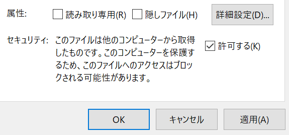

# メールアドレスの入ったCSVファイルからのOffice365のグループメンバー追加コード例

## 目的
Microsoft StreamやTeamsの公開先を限定するための、グループのメンバー登録の手間を省く。

## 制限
まず、使用はあくまでも自らの責任でお願いします。ここで提供するコードの実行に関わって生じることについては当方は一切責任を負いません。

なお、「えいやっという感じ」で最低限のことだけを実装し、限定された環境でのみテストしているものなので、そのつもりで使ってください。
そもそも、自分で使うために作成したものなので、メッセージや使い勝手も最低限としています。

そのため、他の環境ではうまくいかないかもしれませんが、作者はその修正等には応じれないと思います。
もし、修正や機能向上を行った場合は是非公開して欲しいと願っています。

## 実行環境
テスト・開発は以下の環境で行った。
- Microsoft Windows 10 Pro (1909) 64bit. 日本語
  - PowerShellのバージョンや.Net Frameworkの要求は下記の参考文献などを参照のこと
- Microsoft Excel 2016 (CSVファイル作成)

## 環境設定
PowerShellを「管理者として実行」で開き、スクリプト実行許可とモジュールのインストールを行う (「PowerShell (x86)」は32bit版なので使わない)
- スクリプトの実行許可は以下のコマンドを実行すればよい
```
Set-ExecutionPolicy RemoteSigned
```
- Azure AD for Graph (Azure AD v2) モジュールのインストール(途中で信頼されてないリポジトリからインストール云々が出るけど、とりあえずY)
```
Install-Module -Name AzureAD
```
なお、「管理者として実行」はここのみでよい

## 実行に必要なもの

- ここからダウンロードしたスクリプトファイル `gadd2.ps1`
- 1行1ユーザのCSVファイル。先頭行は列タイトル。メンバーとして登録したいメールアドレスが入っている列には「`email`」という名前を付ける (ほかの列は無視する。
```
email,氏名,備考
foo@example.com,織田信長,学生
bar@example.com,明智光秀,学生
baz@example.com,羽柴秀吉,TA
```
- 事前にStreamで作成したグループのメールアドレス
- そのグループ作成時に用いたマイクロソフトアカウントのメールアドレスとパスワード

## 実行
1. PowerShellを開く。 (「PowerShell (x86)」ではなく64bitの方を開く。管理者である必要はない)
2. `gadd2.ps1`を保存したディレクトリに移動し、`.\gadd2.ps1`と投入して実行開始する。
3. 「CSVファイル名を入れてください:」と出るので、上記のCSVファイル名を入力する。
4. 「Group Addressを入れてください:」と出るので、上記のグループのメールアドレスを入力する。
5. 「資格情報を入力してください」というダイアログがポップアップするので、上記のマイクロソフトアカウントのメールアドレスとパスワードを入力する。
6. 画面にメッセージやメンバーに登録するメールアドレスが実行とともに表示され、終了する。

ファイル名などを間違えた際はエラーになり、実行を終了しますが、個々のメンバー登録でエラーが生じても無視して次々とメンバー登録します。
エラーメッセージは赤文字で表示されます。必要に応じてリダイレクトするなどしてください。
個々のメンバー登録で考え得るエラーは、「登録済みの場合」や「そのメールアドレスがマイクロソフトアカウントにない」ことなどが考えられます。

ダウンロードしたままの `gadd2.ps1` ではセキュリティ設定で実行できない場合があります。Windowsの場合はこのファイルのプロパティを開いて、その最下部の「セキュリティ」の「許可する」にチェックをいれてOKすると実行できるようになります。



## その他
- メンバーの追加のみです。グループの作成は事前にStreamで行ってください。
- メンバーの削除はStreamのグループ管理機能を使ってください。
- StreamだけでなくTeamsでも使いたい場合は、Teamsの「チームを作成」で「その他」等を選び、「自分または XXX で設定したグループを使用してチームを作成する」を選ぶとよいようです(「XXX」は自組織名などが入る)。Teams側でメンバーに与える権限は確認するとよさそう。


## 参考文献
- 太田浩史, 渡辺元気, 北端智. Office 365管理者のための逆引きPowerShellハンドブック. 日経BP社. 2018. https://calil.jp/book/4822253740
- Microsoft Docs. Groups and channel settings in Microsoft Stream. https://docs.microsoft.com/en-us/stream/groups-channels-overview
